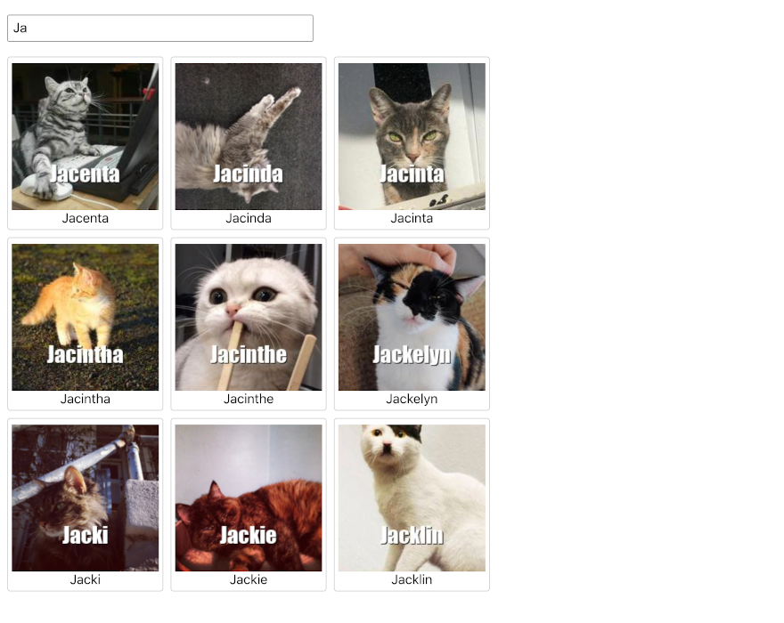

# Cat Search
Your task is to create a simple cat search application.

## The Task
To build cat search, you will update the application in this directory
to request cat information from a backend service. The responses from
the backend will be used to populate the content displayed to the
user. Ultimately, your job is to render a page that looks similar to
this:

The project was bootstrapped with [Create React
App](https://github.com/facebook/create-react-app), and has been
partially built for you. Your task is to complete it, following the
requirements below.

### Application Requirements
1. Requests for cat information are made as the user types in the
   input field (i.e., there is no explicit search submission).
1. Requests must be debounced for 500ms to avoid making them following
   every key stroke.
1. Retrieve cat information by making GET requests of the following
   form:
   https://2xfvfksx0g.execute-api.us-west-2.amazonaws.com/default/cat-names?q=YOUR_QUERY. Try
   [this search for
   "Ja"](https://2xfvfksx0g.execute-api.us-west-2.amazonaws.com/default/cat-names?q=Ja),
   for instance. The response is an array of cats objects with `name`
   and `image_url` properties.
1. When a request is in flight, you should display a progress
   indicator to the user. You can do this by setting the
   `results-loading` class on the `div` that has the `spinner` class
   applied.
1. You must display the results in "cat cards". Each card should show
   the cat's photo and the cat's name below the photo. You should also
   have some sort of visual cue where the card boundaries are. In the
   image above, a simple border was used.
1. Cat cards must be displayed with three cards per row. Of course, if
   the number of results received is not divisible by three, the last
   row will have fewer than three cards.
1. There should be some sort of visual cue when any part of the cat
   card is hovered on. You can decide what to do, but it can be as
   simple as a subtle background color change on hover.
1. When clicked, the cat cards must make a call to `handleCatClick`
   and pass the cat's name as an argument. For example, if the card of
   a cat named Horatia is clicked, your page should make a call to
   `handleCatClick("Horatia")`. If you do this correctly, you will see
   an alert appear saying "That's Horatia!" when Horatia's card is
   clicked.

### Process Requirements
1. Clone this repository and do your work in commits in that clone.
1. Make commits with a reasonable granularity and informative commit
   messages.
1. When it's time to submit, create a patch file for your changes by
   doing `git format-patch origin/main..HEAD --stdout >
   solution.patch` and return solution.patch in an email!

### Other Useful Information
1. The files you will probably be spending most of your time in are
   [CatSearch.js](src/CatSearch.js) and
   [CatSearch.css](src/CatSearch.css).
1. The backend will return up to nine results and as few as zero,
   depending on the query.
1. The images in the cat search response are all 200x200.
1. The [axios](https://github.com/axios/axios) package is already
   installed. You are welcome to use that for your HTTP request, but
   feel free to use something else, if you prefer.
1. You are welcome to add other packages you might want to use (e.g.,
   lodash).
1. Your page does not need to be visually identical to the image shown
   above. The parts that matter are all described in the requirements
   above. Otherwise, use your judgement and make the page look
   reasonable.
1. If you think it will help us in evaluating your solution, feel free
   to modify this README.

## Development

### Installing Packages
Assuming you have the typical Node-npm-Yarn tool setup, just do `yarn
install` to install the project dependencies.

### Running the Application
In the project directory, you do `yarn start`. This runs the app in
the development mode.
